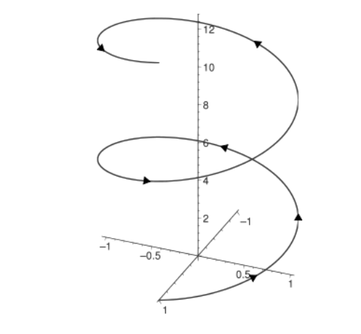

# 3D Curves

- All curves are parametrically defined, i.e. a point is calculated using some $C(t)$ formula.
- Circle is planar in the plane $XoY$ (i.e. all $Z$-coordinates are $0$) and is defined by its radius.
- Ellipse is planar in the plane $XoY$ and is defined by its two radii, along $X$ and $Y$ axes.
- Helix is spatial and is defined by its radius and step (see the figure below). It takes $2\pi$ in parametric space to make a round, i.e. any point on helix satisfies the condition $C(t + 2\pi) = C(t) +
  {0, 0, step}$.



## Build

First, build 3d-curves library:

```bash
cd ~
git clone https://github.com/jmpleo/3d-curves.git
cd 3d-curves/3d-curves
cmake -B build
make
```

This will create `~/3d-curves/3d-curves/lib/lib3d-curves.so`

Then, build `test app`

```bash
cd ~/3d-curves
cmake -B build
cd build
make
```

This will create test app`~/3d-curves/build/app`. Run this:

```bash
build/app
```

